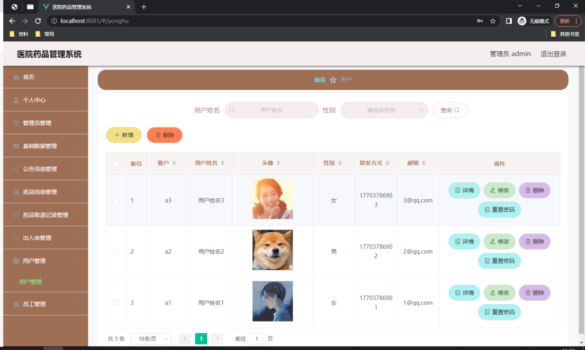
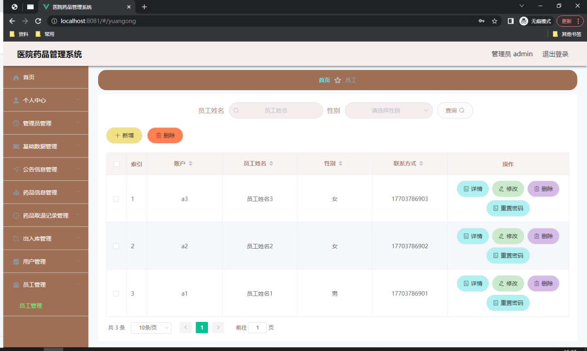
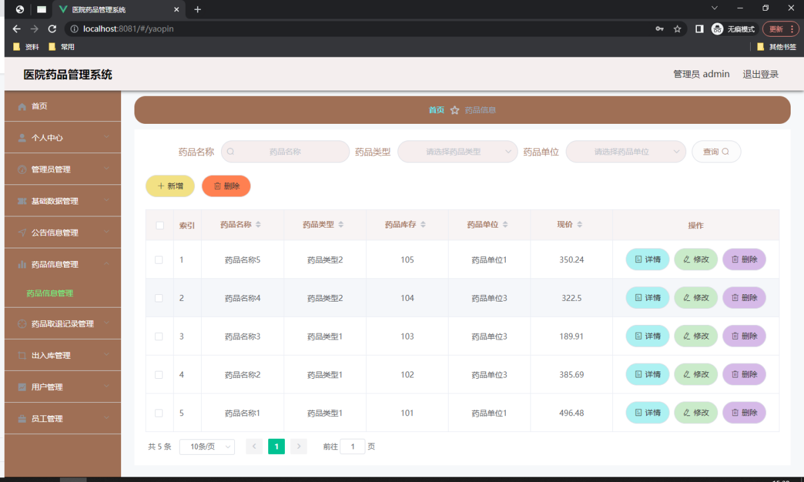
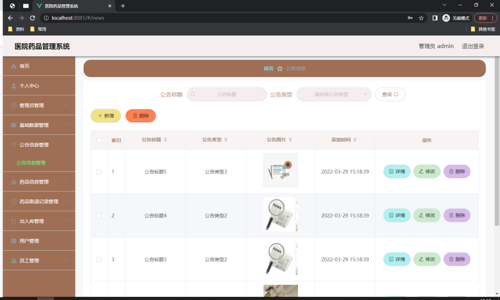
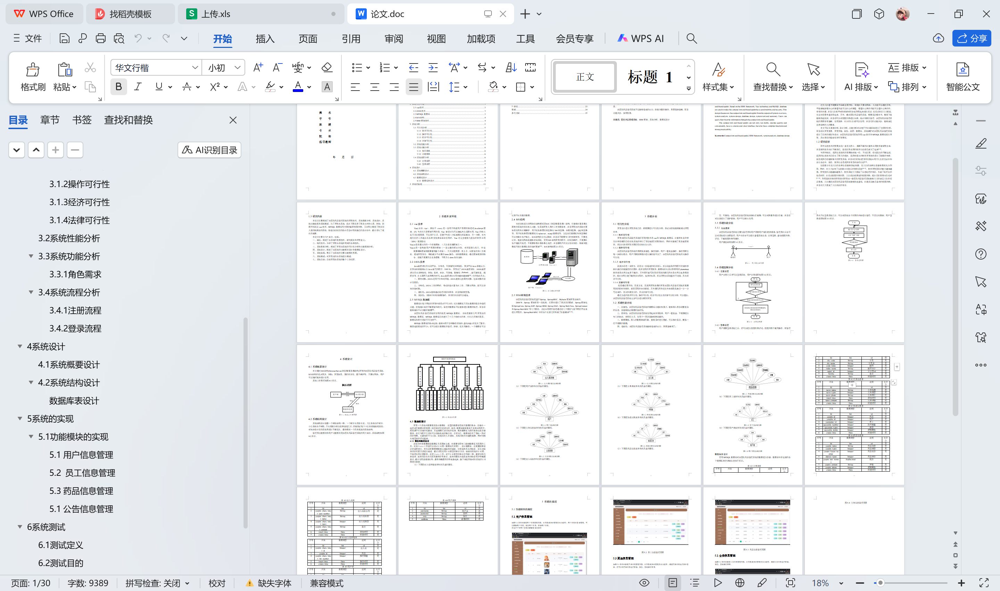

# springboot120-医院药品管理系统设计与实现

>  博主介绍：
>  Hey，我是程序员Chaers，一个专注于计算机领域的程序员
>  十年大厂程序员全栈开发‍ 日常分享项目经验 解决技术难题与技术推荐 承接各类网站设计，小程序开发，毕设等。
>  【计算机专业课程设计，毕业设计项目，Java，微信小程序，安卓APP都可以做，不仅仅是计算机专业，其它专业都可以】

## 3000套系统可挑选，获取链接：https://chaerspol.github.io/

<b>QQ【获取完整源码】：674456564</b>

<b>QQ群【获取完整源码】：1058861570</b>

### 系统架构

> 前端：html | js | css | jquery | vue
>
> 后端：springboot | mybatis
> 
> 环境：jdk1.8+ | mysql | maven

# 一、内容包括
包括有  项目源码+项目论文+数据库源码+答辩ppt+远程调试成功

# 二、运行环境

> jdk版本：1.8 及以上； ide工具：IDEA； 数据库: mysql5.7及以上；编程语言: Java

# 三、需求分析

**3.1可行性分析**

开发者在进行开发系统之前，都需要进行可行性分析，保证该系统能够被成功开发出来。

**3.1.1技术可行性**

开发该医院药品管理系统所采用的技术是vue和MYSQL数据库。计算机专业的学生在学校期间已经比较系统的学习了很多编程方面的知识，同时也接触了很多编程软件，所以在技术开发方面还是比较有信心的。

**3.1.2操作可行性**

该医院药品管理系统的界面简洁清楚，操作简单，用户一看就会操作。操作界面上每一步都有提示，用户只要按照提示进行操作就可以了。该医院药品管理系统具有操作可行性。

**3.1.3经济可行性**

我现在还是一名学生，还没有一份稳定的经济收入，所以我会将开发程序的成本控制在自己所能接受的范围内。我所使用的开发软件、数据库还有设计界面用的photoshop软件都是在网上免费下载的，另外程序编写阶段所用到的源代码也是在网上免费得到的，现在在网上能下载很多有用的、免费的东西，所以开发该系统基本不花钱，具有经济可行性。

**3.1.4法律可行性**

我是通过图书馆、百度文库、百度网页等获得的开发该医院药品管理系统所需要用到的资料和软件，都是采用的合法渠道，另外源代码和论文内容都是我自己一字一字写出来的，没有抄袭别人的，具有法律可行性。
通过上述的技术可行性、操作可行性、经济可行性以及法律可行性分析，可以看出，该医院药品管理系统完全可以进行顺利开发。

**3.2系统性能分析**

一、存储性：该医院药品管理系统的数据库功能比较强大，能够录入很多纷繁复杂的信息，且能够保证数据的实时性；

二、易学性：该医院药品管理系统使用起来非常简单，用户一看就会，不需要进行专门的培训，非常好上手，使用个一两次就能够熟练操作；

三、数据要求：录入的数据准确可靠，能够及时进行更新，可以独立保存，删除一些不需要的数据；

四、稳定性：该医院药品管理系统能够稳定的运行，界面清晰明了；

五、可靠性：该医院药品管理系统安装有拦截器，可以对病毒等进行拦截，并且还对信息进行了保护措施，用户可以放心使用。

# 四、功能模块

系统结构设计就像一个树状结构一样，一个树干有很多分支，大任务相当于树干，小任务相当于树枝，只有需求分析信息弄清楚之后，才能保证每个小任务都能实现目标，对初步设计好的系统再进行不断优化，最终得到一个具体现实的系统结构。管理员功能模块和用户功能模块是该医院药品管理系统的两大部分，系统结构如图

# 五、效果图展示【部分效果图】

图5.1 用户信息管理页面【此页面提供给管理员的功能有：用户信息的查询管理，可以删除用户信息、修改用户信息、新增用户信息，还进行了对用户名称的模糊查询的条件】

图5.2 员工信息管理页面【此页面提供给管理员的功能有：查看已发布的员工信息数据，修改员工信息，员工信息作废，即可删除，还进行了对员工信息名称的模糊查询 员工信息信息的类型查询等等一些条件】

图5.3 药品信息管理页面【此页面提供给管理员的功能有：根据药品信息进行条件查询，还可以对药品信息进行新增、修改、查询操作等等。】

图5.4 公告信息管理页面【此页面提供给管理员的功能有：根据公告信息进行新增、修改、查询操作等等】

 <b>完整文章</b>
 
 
 

## 3000套系统可挑选，获取链接：https://chaerspol.github.io/

<b>QQ【获取完整源码】：674456564</b>

<b>QQ群【获取完整源码】：1058861570</b>

